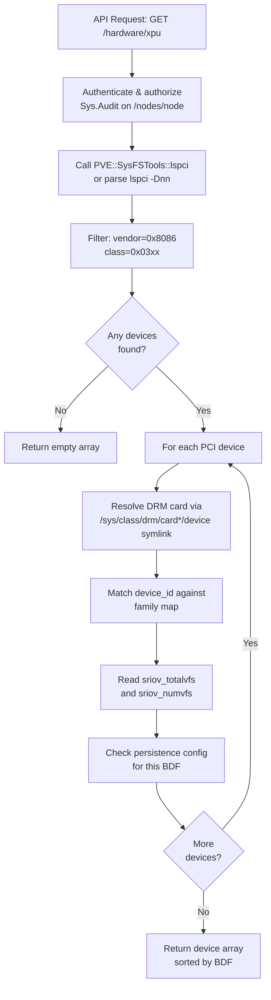
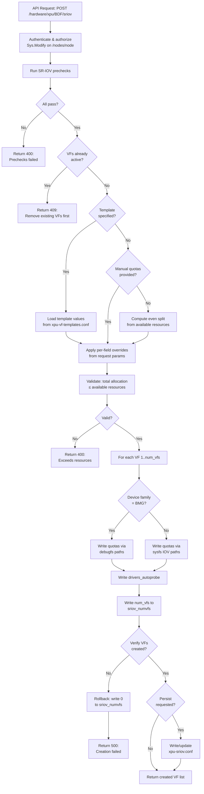
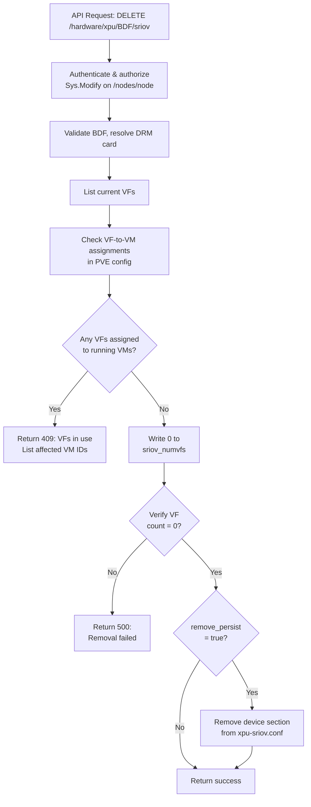
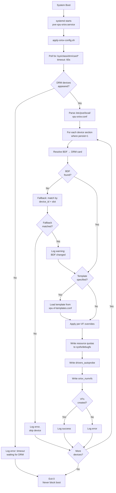
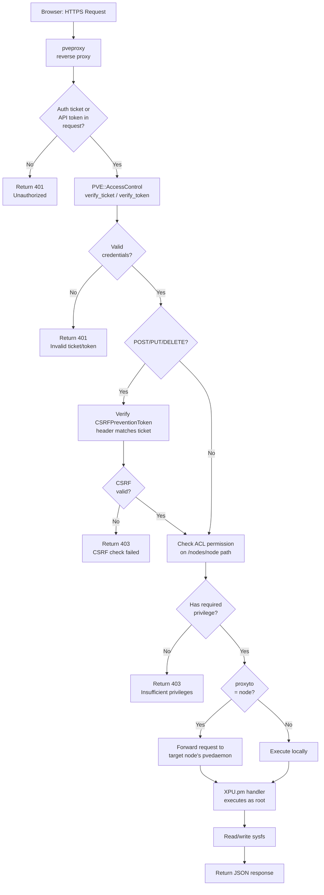
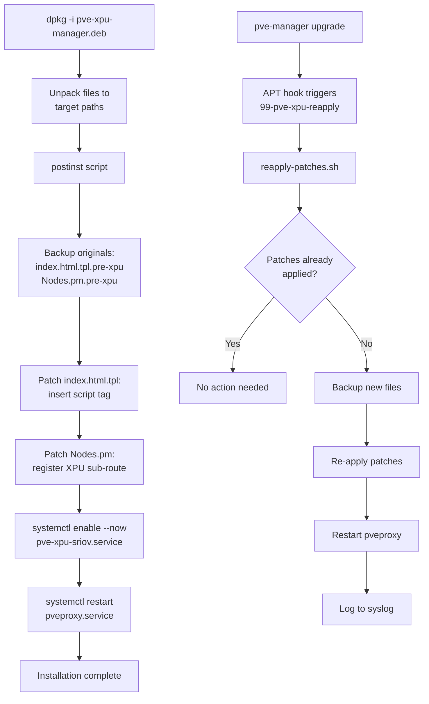
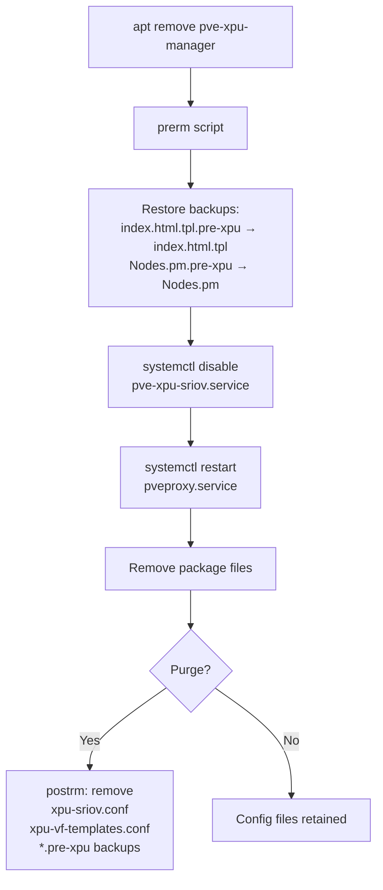
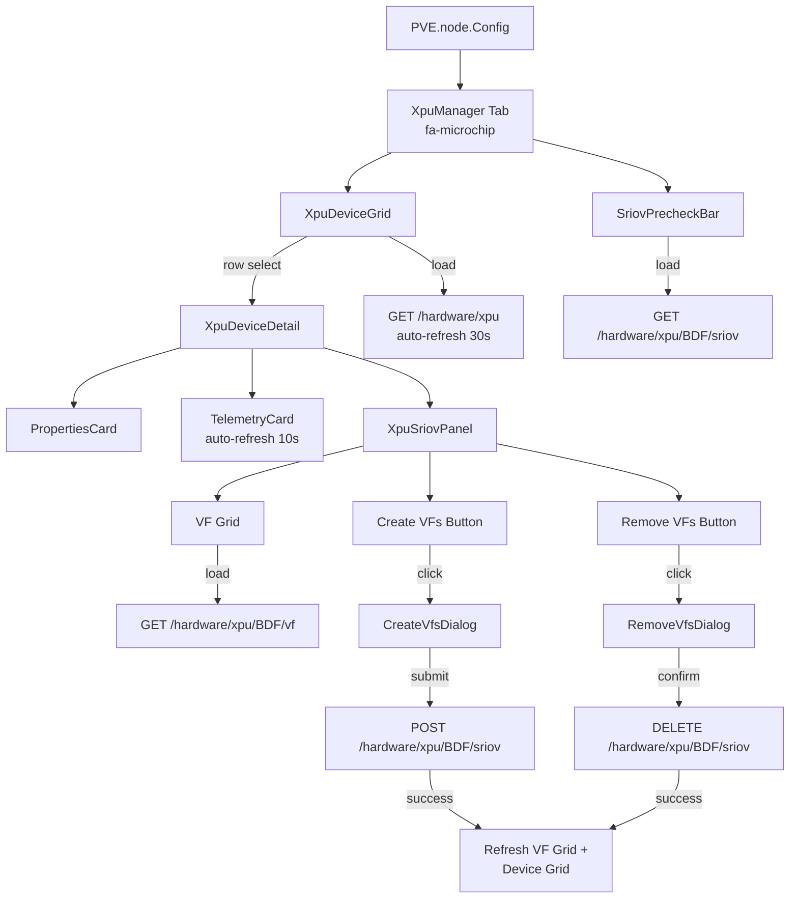
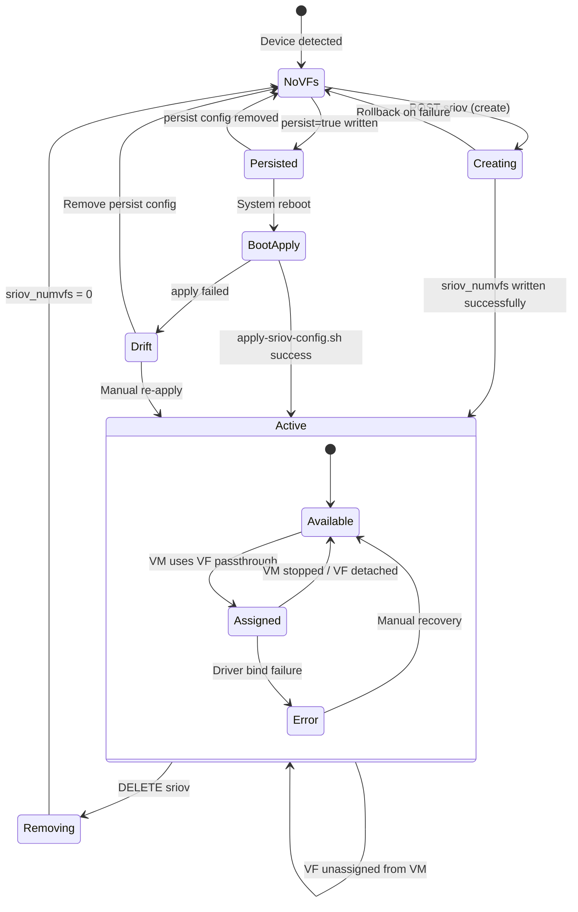

# PVE XPU/GPU Manager — UI Mockups & Workflow Diagrams

## 1. UI Mockups

### 1.1 Node Tab — XPU/GPU Main View

```
┌─────────────────────────────────────────────────────────────────────────────┐
│  Datacenter > node1 > XPU/GPU                                    [fa-microchip] │
├─────────────────────────────────────────────────────────────────────────────┤
│                                                                             │
│  SR-IOV Prerequisites                                                       │
│  ┌────────────────┐ ┌──────────────┐ ┌────────────────┐ ┌───────────────┐  │
│  │ ✓ CPU Virt.    │ │ ✓ IOMMU      │ │ ✓ SR-IOV BIOS  │ │ ✓ i915 Driver │  │
│  │   (VT-x)      │ │   (VT-d)     │ │   Enabled      │ │   Loaded      │  │
│  └────────────────┘ └──────────────┘ └────────────────┘ └───────────────┘  │
│                                                                             │
│  ┌─ Toolbar ──────────────────────────────────────────────────────────────┐ │
│  │ [↻ Refresh]                                                           │ │
│  └────────────────────────────────────────────────────────────────────────┘ │
│                                                                             │
│  ┌─ GPU Devices ──────────────────────────────────────────────────────────┐ │
│  │ Device                       │ BDF           │ ID     │ Temp │ SR-IOV │ │
│  │─────────────────────────────│───────────────│────────│──────│────────│ │
│  │ Intel DC GPU Flex 170       │ 0000:03:00.0  │ 0x56c0 │ 42°C │ Active │ │
│  │                             │               │        │      │ (4 VFs)│ │
│  │─────────────────────────────│───────────────│────────│──────│────────│ │
│  │ Intel DC GPU Flex 140       │ 0000:04:00.0  │ 0x56c1 │ 38°C │Capable │ │
│  │─────────────────────────────│───────────────│────────│──────│────────│ │
│  │ Intel Arc A770              │ 0000:05:00.0  │ 0x5690 │ 35°C │  N/A   │ │
│  └────────────────────────────────────────────────────────────────────────┘ │
│                                                                             │
│  ┌─ Device Detail: Intel DC GPU Flex 170 (0000:03:00.0) ─────────────────┐ │
│  │                                                                        │ │
│  │  Properties                        Telemetry                           │ │
│  │  ┌──────────────────────────┐     ┌──────────────────────────────────┐ │ │
│  │  │ Family:    Flex (ATS-M)  │     │  Temperature    Power    Memory  │ │ │
│  │  │ Device ID: 0x56c0       │     │  ┌────┐       ┌────┐   ┌──────┐ │ │ │
│  │  │ Driver:    i915          │     │  │    │       │    │   │██████│ │ │ │
│  │  │ DRM Card:  card0         │     │  │ 42 │ °C    │ 65 │ W │ 52%  │ │ │ │
│  │  │ Render:    renderD128    │     │  │    │       │    │   │      │ │ │ │
│  │  │ NUMA:      0             │     │  └────┘       └────┘   └──────┘ │ │ │
│  │  │ Tiles:     1             │     │  0   50  105  0  150   0   16GB │ │ │
│  │  │ Max VFs:   31            │     └──────────────────────────────────┘ │ │
│  │  └──────────────────────────┘                                          │ │
│  │                                                                        │ │
│  │  SR-IOV Virtual Functions                                              │ │
│  │  ┌─ Toolbar ────────────────────────────────────────────────────────┐  │ │
│  │  │ [+ Create VFs]  [✕ Remove All VFs]                              │  │ │
│  │  └──────────────────────────────────────────────────────────────────┘  │ │
│  │  ┌──────────────────────────────────────────────────────────────────┐  │ │
│  │  │ VF# │ BDF           │ LMEM      │ GGTT      │ Status    │ VM   │  │ │
│  │  │─────│───────────────│───────────│───────────│───────────│──────│  │ │
│  │  │  1  │ 0000:03:00.1  │ 4.00 GB   │ 960 MB    │ Available │  —   │  │ │
│  │  │  2  │ 0000:03:00.2  │ 4.00 GB   │ 960 MB    │ Assigned  │ 101  │  │ │
│  │  │  3  │ 0000:03:00.3  │ 4.00 GB   │ 960 MB    │ Available │  —   │  │ │
│  │  │  4  │ 0000:03:00.4  │ 4.00 GB   │ 960 MB    │ Assigned  │ 102  │  │ │
│  │  └──────────────────────────────────────────────────────────────────┘  │ │
│  └────────────────────────────────────────────────────────────────────────┘ │
└─────────────────────────────────────────────────────────────────────────────┘
```

### 1.2 Create VFs Dialog

```
┌─── Create Virtual Functions ─────────────────────────────┐
│                                                           │
│  Device: Intel DC GPU Flex 170 (0000:03:00.0)            │
│  Available: 31 VFs max, 16 GB LMEM, 4 GB GGTT           │
│                                                           │
│  ┌─────────────────────────────────────────────────────┐ │
│  │ Number of VFs:    [  4  ▾]   (1–31)                 │ │
│  │                                                      │ │
│  │ Template:         [ flex-56c0-4vf           ▾]      │ │
│  │                   [ ○ None (manual)          ]      │ │
│  │                   [ ● flex-56c0-4vf          ]      │ │
│  │                   [   flex-56c0-2vf          ]      │ │
│  │                                                      │ │
│  │ ── Resource Allocation (per VF) ──────────────────  │ │
│  │                                                      │ │
│  │ LMEM per VF:     [ 4,194,304,000 ] bytes  (4.0 GB) │ │
│  │ GGTT per VF:     [ 1,006,632,960 ] bytes  (960 MB) │ │
│  │ Contexts:        [ 1024          ]                   │ │
│  │ Doorbells:       [ 60            ]                   │ │
│  │ Exec Quantum:    [ 20            ] ms                │ │
│  │ Preempt Timeout: [ 1000          ] μs                │ │
│  │                                                      │ │
│  │ ── Options ───────────────────────────────────────  │ │
│  │                                                      │ │
│  │ [✓] Persist across reboots                          │ │
│  │ [ ] Auto-probe drivers                              │ │
│  └─────────────────────────────────────────────────────┘ │
│                                                           │
│  Total LMEM: 16.0 GB / 16.0 GB  ████████████████ 100%   │
│  Total GGTT:  3.8 GB /  4.0 GB  ██████████████░░  94%   │
│                                                           │
│                              [ Cancel ]  [ Create VFs ]  │
└───────────────────────────────────────────────────────────┘
```

### 1.3 Remove VFs Confirmation Dialog

```
┌─── Remove Virtual Functions ─────────────────────────────┐
│                                                           │
│  ⚠  Are you sure you want to remove all 4 virtual        │
│     functions from Intel DC GPU Flex 170?                 │
│                                                           │
│  Device: 0000:03:00.0                                    │
│                                                           │
│  ⚠  VF 2 is assigned to VM 101                           │
│  ⚠  VF 4 is assigned to VM 102                           │
│                                                           │
│  These VMs must be stopped before VFs can be removed.     │
│                                                           │
│  [✓] Also remove persistent boot configuration           │
│                                                           │
│                              [ Cancel ]  [ Remove VFs ]  │
└───────────────────────────────────────────────────────────┘
```

### 1.4 Precheck Failure State

```
┌─── SR-IOV Prerequisites ─────────────────────────────────┐
│                                                           │
│  ✓ CPU Virtualization   VT-x enabled                     │
│  ✗ IOMMU                Not detected — enable VT-d in    │
│                         BIOS and add intel_iommu=on to   │
│                         kernel command line               │
│  ✓ SR-IOV BIOS          sriov_totalvfs = 31              │
│  ✓ i915 Driver          Loaded                           │
│                                                           │
│  ⚠ SR-IOV management disabled until all checks pass      │
│                                                           │
└───────────────────────────────────────────────────────────┘
```

### 1.5 Drift Warning Banner

```
┌─── ⚠ Configuration Drift Detected ──────────────────────┐
│                                                           │
│  Persisted: 4 VFs — Current: 0 VFs                       │
│  The saved SR-IOV configuration does not match the        │
│  running state. This may happen after a failed boot       │
│  apply or manual changes.                                 │
│                                                           │
│  [ Re-apply Config ]  [ Dismiss ]                        │
└───────────────────────────────────────────────────────────┘
```

---

## 2. Workflow Diagrams

### 2.1 Device Enumeration Flow



### 2.2 SR-IOV Precheck Flow

```mermaid
flowchart TD
    A[API Request: GET /hardware/xpu/BDF/sriov] --> B[Authenticate & authorize]
    B --> C[Validate BDF format]
    C --> D[Check 1: CPU Virtualization]
    D --> D1[Parse /proc/cpuinfo flags]
    D1 --> D2{vmx or svm<br/>present?}
    D2 -- Yes --> E[Check 2: IOMMU]
    D2 -- No --> D3[Record FAIL:<br/>VT-x/AMD-V not enabled]
    D3 --> E
    E --> E1[Check /sys/class/iommu/*]
    E1 --> E2{IOMMU devices<br/>exist?}
    E2 -- Yes --> F[Check 3: SR-IOV BIOS]
    E2 -- No --> E3[Record FAIL:<br/>IOMMU not enabled]
    E3 --> F
    F --> F1[Read sriov_totalvfs]
    F1 --> F2{Value > 0?}
    F2 -- Yes --> G[Check 4: i915 Driver]
    F2 -- No --> F3[Record FAIL:<br/>SR-IOV not in BIOS]
    F3 --> G
    G --> G1[Read driver symlink<br/>basename]
    G1 --> G2{Driver = i915?}
    G2 -- Yes --> H[Read available resources<br/>from IOV sysfs tree]
    G2 -- No --> G3[Record FAIL:<br/>Wrong driver]
    G3 --> H
    H --> I[Load persisted config<br/>if present]
    I --> J[Check for drift between<br/>persisted and runtime state]
    J --> K[Return precheck result<br/>with all_pass flag]
```



### 2.3 VF Creation Flow



### 2.4 VF Removal Flow



### 2.5 Boot Persistence Flow



### 2.6 API Request Authentication Flow



### 2.7 Package Installation Flow



### 2.8 Package Removal Flow



### 2.9 Frontend Component Interaction



---

## 3. State Machine: VF Lifecycle



---

## 4. Data Flow: Telemetry Collection

```mermaid
flowchart LR
    subgraph Kernel
        A[hwmon driver] --> B[/sys/.../temp*_input<br/>millidegrees C]
        A --> C[/sys/.../power*_input<br/>microwatts]
        D[i915 driver] --> E[/sys/.../iov/pf/gt*/available/<br/>lmem_free bytes]
        D --> F[/sys/.../tile*/gt_cur_freq_mhz]
    end

    subgraph "XPU.pm (Perl)"
        B --> G[Read & convert<br/>÷ 1000 → °C]
        C --> H[Read & convert<br/>÷ 1000000 → W]
        E --> I[Read bytes<br/>compute % used]
        F --> J[Read MHz]
        G --> K[JSON response]
        H --> K
        I --> K
        J --> K
    end

    subgraph "Browser (ExtJS)"
        K --> L[Temperature Gauge<br/>0-105°C]
        K --> M[Power Gauge<br/>0-TDP W]
        K --> N[Memory Bar<br/>used/total]
    end
```
